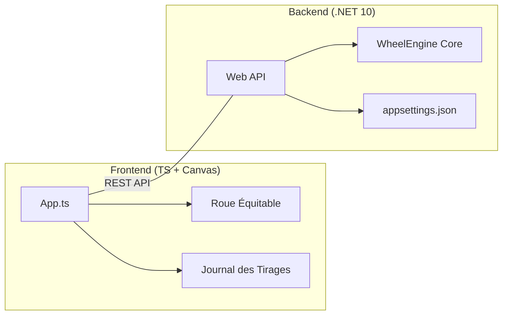

# 🎡 Roue de la Chance

Une application de tirage au sort avec une roue dynamique (courbe de Béziers), un journal des gains en temps réel et un back-end .NET 10.

---

## 🏗️ Architecture Technique



---

## ✨ Nouveautés Majeures

> **Parts Équidistantes** : Les parts de la roue affichent toutes la même taille visuelle pour une meilleure esthétique, indépendamment de leurs probabilités réelles.

> **Saisie d'Email & Compteurs en Direct** : L'interface intègre désormais des compteurs visuels des lots restants et nécessite la saisie d'un e-mail avant chaque tirage.

> **Journal Historique** : Un panneau latéral noir suit désormais chaque résultat de tirage (gagné ou perdu) en temps réel avec l'heure associée.

> **Export CSV Direct (`/csv`)** : Tous les tirages (avec date précise `yyyyMMddHHmmssfff`, e-mail et résultat) s'enregistrent dans un export CSV. Ce fichier est consultable directement en texte brut depuis le navigateur via l'adresse `http://<serveur>/csv` !

---

## 🚀 Démarrage Rapide

### 💻 Développement Local
```powershell
# 1. Build du Front (obligatoire)
.\build-front.ps1

# 2. Lancer le serveur back
dotnet run -p RoueDeLaChance.Web
```

### 🐳 Déploiement Docker (Production)
Un script Bash automatisé a été créé pour simplifier les mises à jour régulières (`git pull` et reset Docker).

Pour redéployer la toute dernière version de GitHub depuis votre serveur :
```bash
./deploy.sh
```


## 🎨 Personnalisation

| Fichier | Rôle |
| :--- | :--- |
| `RoueDeLaChance.Web/appsettings.json` | Modifier les **lots**, probabilités et quantités.


> Stack : .NET 10 + TypeScript + Canvas + Docker
