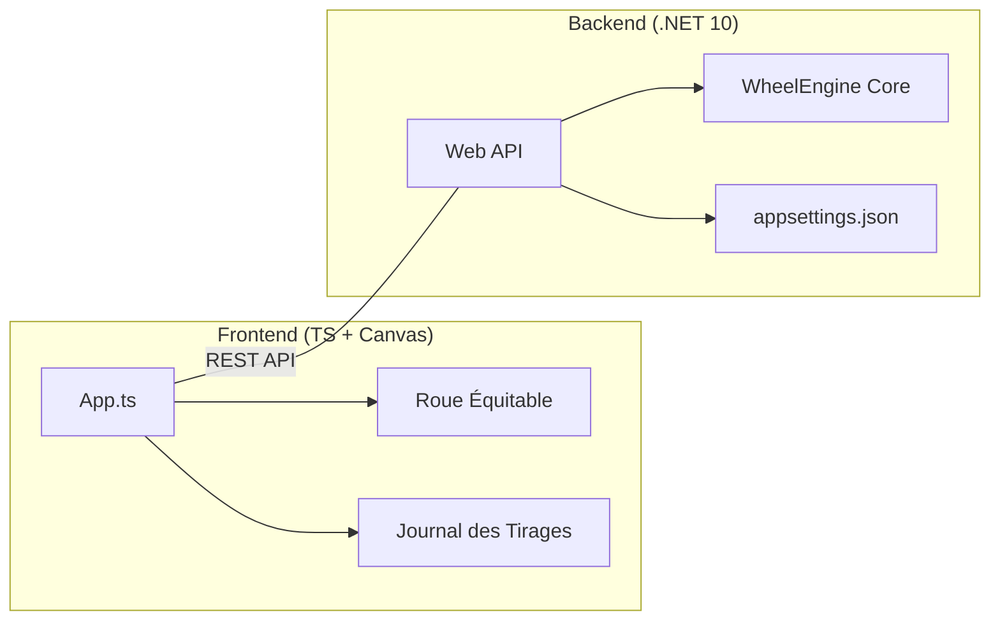

# 🎡 Roue de la Chance - v2.0

Une application de tirage au sort avec une roue dynamique (courbe de Béziers), un journal des gains en temps réel et un back-end .NET 10.

---

## 🏗️ Architecture Technique



---

## ✨ Nouveautés Majeures

> **Parts Équidistantes** : Désormais, toutes les parts de la roue ont la même taille visuelle, indépendamment de leur probabilité réelle.

> **Journal Historique** : Un panneau latéral noir (30% de l'écran) suit désormais chaque tirage avec l'heure exacte et le résultat.

---

## 🚀 Démarrage Rapide

### 💻 Développement Local
```powershell
# 1. Build du Front (obligatoire)
.\build-front.ps1

# 2. Lancer le serveur back
dotnet run -p RoueDeLaChance.Web
```

### 🐳 Déploiement Docker (Production)
Pour mettre à jour votre serveur après un `git pull` :

```bash
# Reconstruction de l'image (bien noter le '.')
docker build -t roue-chance .

# Nettoyage si disque plein
docker system prune -a

# Relance du conteneur
docker stop MaRoue ; docker rm MaRoue
docker run -d --name MaRoue --restart always -p 8080:8080 roue-chance
```

---

## 🎨 Personnalisation

| Fichier | Rôle |
| :--- | :--- |
| `RoueDeLaChance.Web/appsettings.json` | Modifier les **lots**, probabilités et quantités. |
| `RoueDeLaChance.Front/src/app.ts` | Modifier la **palette de couleurs** (AROLLA_PALETTE). |
| `RoueDeLaChance.Front/css/styles.css` | Changer le **design** (largeur journal, bordures, etc). |

---

> Stack : .NET 10 + TypeScript + Canvas + Docker
